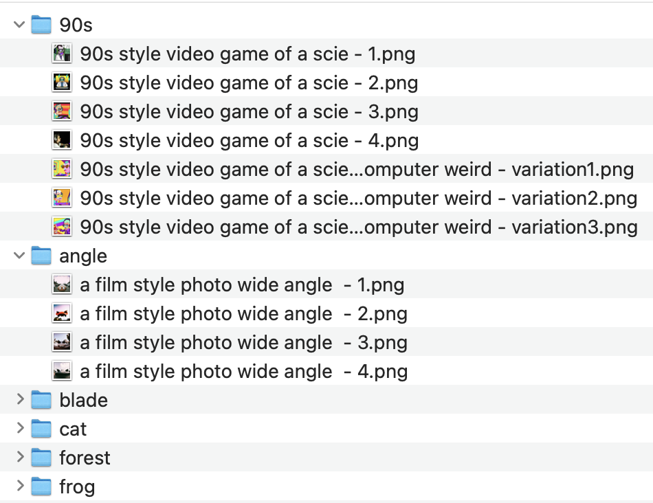

imagesortR
================
Andrew Schwenke
8/11/2022

<p align="center">


</p>

### Features:

- 🗝 create keyword frequency list from a directory of images
- 🗂 sort images into folders based on keywords

### Installation:

``` r
library(devtools)
install_github('andrew-1234/imgsortR')
```

### Description:

I’ve been enjoying using [Dall-E 2](https://openai.com/dall-e-2/) to
generate images, and so I wanted a way to quickly sort them into folders
based on keywords.

This package will read a directory of images and sort them into folders.
They don’t have to actually be from Dall-E 2, the only requirement is
that images contain keywords as text. E.g.
`fox eating a mango in the matrix.png`. I use the DALL-E 2 Image
Downloader extension in chrome to download the image results of a
prompt, and the file names inherit some of the prompt keywords.

Keep in mind this is my first R package! I wanted to practice making a
package in R, and I’m learning a lot in this process 😁. But I realise
that this is a very specific use case and I don’t expect anybody will be
using this. But if you are actually interested and want to use the
package, I’m eager for feedback, suggestions, bugs, additional use
cases, or just a star if you like it. Thanks!

### Use:

The first function will read the directory where your images are, and
extract the most common keywords (after filtering for stop words).
**Note**: currently, images have to be in the parent level rather than
in sub folders.

``` r
library(imgsortR)

my_dat <- dalle_import(imgpath = "~/Pictures/dall-e-test2/")
```

The second function will start by picking the most common keyword, and
looking for matches in your image titles. If an image title is found
that contains the keyword, that image will be copied into a directory,
with the name of that keyword (directories are created if they don’t
exist). The image is then removed from the master list so that images
are **not sorted more than once**. And then the next keyword is checked.
Note: no images are deleted! You can do that after sorting if you would
like.

``` r
sort_images(keywords = my_dat, imgpath = "~/Pictures/dall-e-test2/")
# Console output while running the function:
# there was a keyword match... frog
# directory already exists, copying files...
# there was a keyword match... 90s
# created a new directory...
# no matches... game
# no matches... video
# there was a keyword match... angle
# created a new directory...
```

Example folder structure after running the function, where folders
contain the image copies:

<p align="center">



</p>

### Additional notes and limitations

You might notice some weird folders get created that you didn’t expect.
For example, terms might get separated, like “playstation 1” will be
separated into “playstation” and “1”. I added a gsub to replace this,
because I didn’t want a folder called “1”. So add more if you need in
the `dalle_import` function. See the example below:

``` r
dalle_images_t$x <-
        gsub("playstation 1", "playstationone", dalle_images_t$x)
```

**Note**: there are other random stopwords I tried to filter that are
specific to Dall E prompts like “style”, “wearing” etc. Add more of
those if you need. In the future it would be cool to have a full list of
common Dall E stopwords, but I don’t think anyone will be using this
package so I’ll add them as needed.
